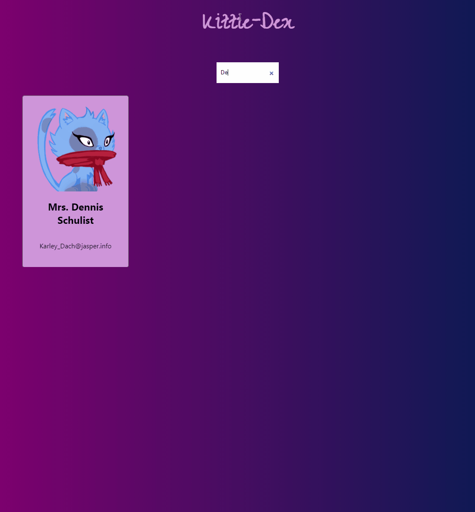

# Search-box

A basic search-box component. 

## Example Usage 

To use, simply copy the component files into your own component directory within a <code>React</code> project. To reposition the component, remove the atom styles for the container in css, this will automatically add the hamburger to the top-right. 

Import the component into your <code>App.js</code>:

<code>
<pre>
        import { AtomicHamburger } from './components/animated-atom/animated-atom.component';
</pre>
</code>

And render the component in your render function via the tag.

## Goes Well With

- [CardList](https://github.com/XYZ-Components/card-list)
- [Card](https://github.com/XYZ-Components/card)

# Please Note

My components assume you are following <code>CSS</code> best practices. As such, it is assumed
your default <code>font-size</code> is set in your <code>html</code> tags as <code>10px</code>. All calculations
are done on this basis to make scaling simpler using <code>rem</code>. 
